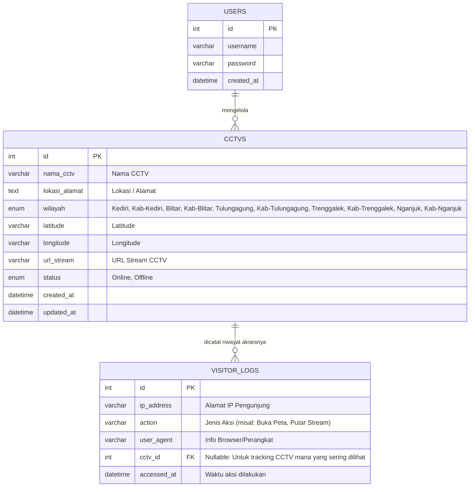

# Skema Database CAKRA (CCTV Karesidenan Kediri)

Berikut adalah rancangan struktur *database* untuk aplikasi CAKRA. Diagram di bawah ini akan otomatis dirender oleh GitHub.

## 1. Entity Relationship Diagram (ERD)

## 2. Rincian Tabel dan Tipe Data

### Tabel: users
Digunakan untuk menyimpan data administrator yang memiliki akses untuk mengelola data CCTV.
- `id` (int) - **Primary Key**
- `username` (varchar)
- `password` (varchar)
- `created_at` (datetime)

### Tabel: cctvs
Menyimpan data master titik lokasi CCTV dan link streaming-nya.
- `id` (int) - **Primary Key**
- `nama_cctv` (varchar) - Nama titik CCTV.
- `lokasi_alamat` (text) - Alamat lengkap lokasi.
- `wilayah` (enum) - Pilihan: Kediri, Kab-Kediri, Blitar, Kab-Blitar, Tulungagung, Kab-Tulungagung, Trenggalek, Kab-Trenggalek, Nganjuk, Kab-Nganjuk.
- `latitude` (varchar) - Koordinat garis lintang.
- `longitude` (varchar) - Koordinat garis bujur.
- `url_stream` (varchar) - Tautan ke stream CCTV (misal: RTSP atau HLS).
- `status` (enum) - Pilihan: Online, Offline.
- `created_at` (datetime)
- `updated_at` (datetime)

### Tabel: visitor_logs
Mencatat riwayat aktivitas pengguna publik yang mengakses situs CAKRA untuk keperluan analitik.
- `id` (int) - **Primary Key**
- `ip_address` (varchar) - Alamat IP pengunjung aplikasi.
- `action` (varchar) - Aksi spesifik (misal: "Buka Peta", "Putar Stream").
- `user_agent` (varchar) - Data browser atau perangkat keras pengunjung.
- `cctv_id` (int) - **Foreign Key** (Nullable). Merujuk ke cctvs.id untuk mengetahui CCTV mana yang sedang diputar.
- `accessed_at` (datetime) - Waktu log dicatat.